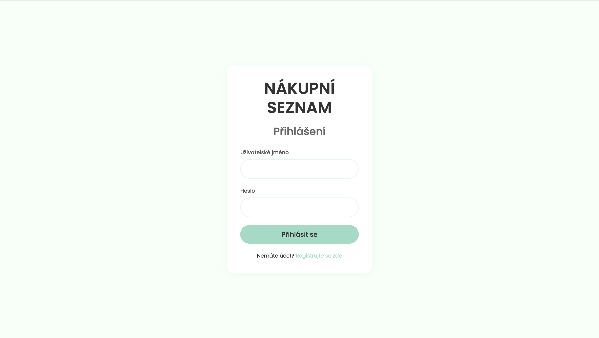
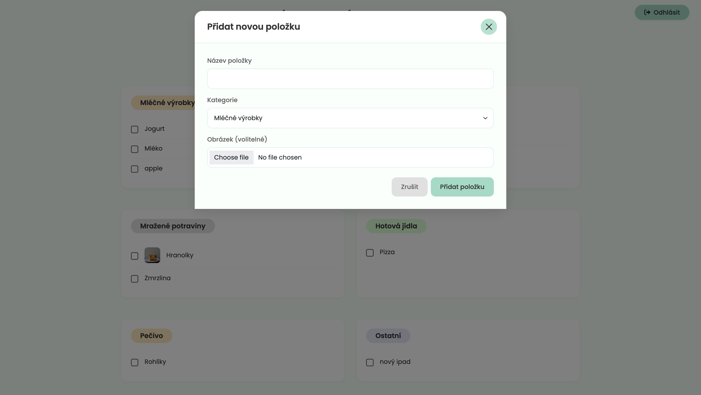
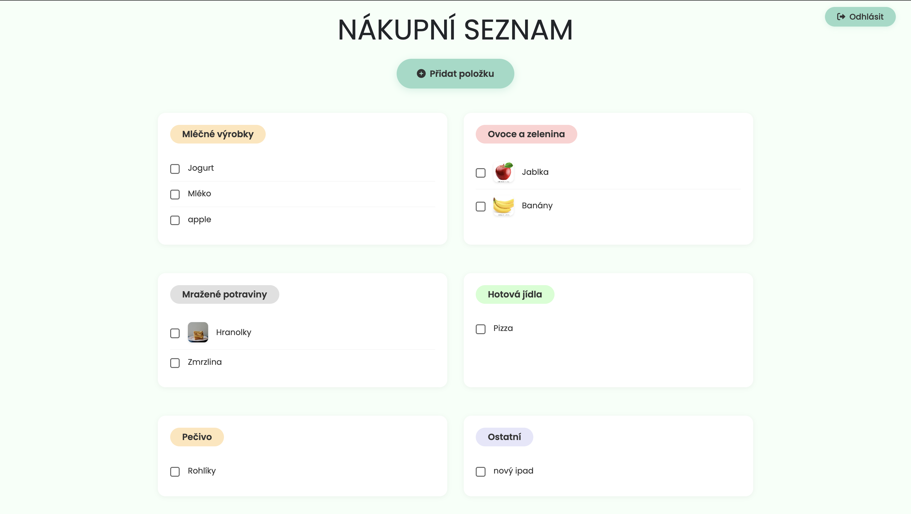
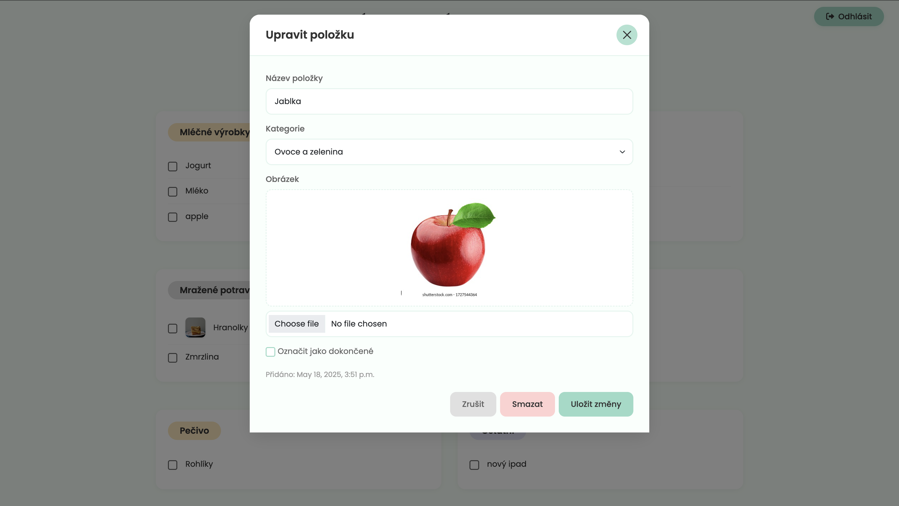
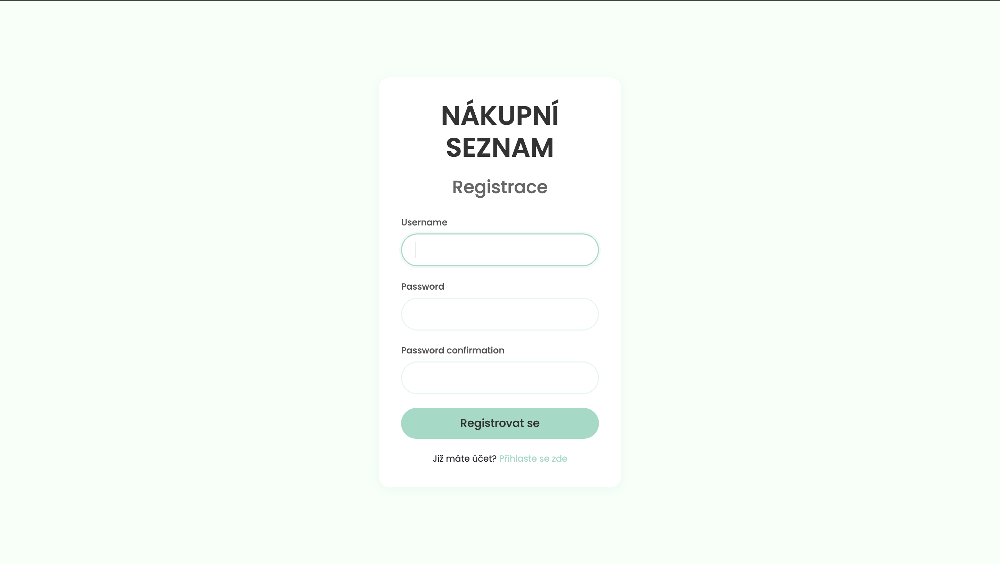

# 🛒 Nákupní Seznam v Django

Moderní webová aplikace pro správu nákupního seznamu vytvořená v Django frameworku. Aplikace nabízí intuitivní uživatelské rozhraní s příjemným designem a kompletní správou položek nákupního seznamu.

## 📸 Ukázky aplikace

### Přihlašovací obrazovka

Přehledné přihlašovací rozhraní s moderním designem pro snadný přístup do aplikace.

### Přidání nové položky

Modální okno pro přidání nové položky do nákupního seznamu s možností výběru kategorie a nahrání obrázku.

### Hlavní přehled

Hlavní stránka aplikace zobrazuje přehledně organizovaný nákupní seznam rozdělený do kategorií:
- Mléčné výrobky
- Ovoce a zelenina
- Mražené potraviny
- Hotová jídla
- Pečivo
- Ostatní

### Detail položky

Detailní zobrazení položky s možností úpravy všech parametrů včetně kategorie a obrázku.

### Registrace

Registrační formulář pro vytvoření nového účtu s intuitivním rozhraním.

## 🌟 Hlavní funkce

- **Správa položek**
  - Přidávání nových položek s obrázky
  - Kategorizace položek (mléčné výrobky, ovoce a zelenina, atd.)
  - Označování položek jako dokončené
  - Mazání jednotlivých položek nebo celého seznamu

- **Uživatelský systém**
  - Registrace nových uživatelů
  - Přihlášení/odhlášení
  - Oddělené seznamy pro každého uživatele

- **Moderní UI/UX**
  - Responzivní design
  - Příjemné mátové barevné schéma
  - Animace a přechody
  - Modální okna pro akce

## 🏗 Architektura

Projekt využívá standardní Django architekturu s rozdělením na projekt a aplikaci:

```
django-shopping-list/
│
├── shopping_project/          # Hlavní projekt
│   ├── settings.py           # Nastavení projektu
│   ├── urls.py               # Hlavní URL konfigurace
│   └── wsgi.py              # WSGI konfigurace
│
├── shopping_list/            # Hlavní aplikace
│   ├── models.py            # Databázové modely
│   ├── views.py             # View logika
│   ├── urls.py              # URL patterns aplikace
│   ├── templatetags/        # Vlastní template tagy
│   ├── management/          # Management příkazy
│   ├── static/              # Statické soubory
│   └── templates/           # HTML šablony
│
├── templates/                # Globální šablony
│   ├── base.html           # Základní šablona
│   └── registration/       # Autentizační šablony
│
├── media/                    # Uploadované soubory
├── venv/                     # Virtuální prostředí
├── requirements.txt          # Python závislosti
├── manage.py                # Django CLI
└── db.sqlite3               # SQLite databáze
```

## 💾 Databázový model

- **ShoppingItem**
  - `itemname`: název položky
  - `completed`: stav dokončení
  - `date_added`: datum přidání
  - `category`: kategorie položky
  - `image`: obrázek položky (volitelné)
  - `user`: vazba na uživatele

## 🚀 Instalace a spuštění

### Požadavky
- Python 3.8 nebo vyšší
- pip (Python package manager)
- Virtuální prostředí (doporučeno)

### 1. Klonování repozitáře
```bash
git clone https://github.com/korkus18/Django-Shopping-List.git
cd django-shopping-list
```

### 2. Vytvoření virtuálního prostředí
```bash
# Vytvoření
python3 -m venv venv

# Aktivace na macOS/Linux
source venv/bin/activate

# Aktivace na Windows
venv\Scripts\activate
```

### 3. Instalace závislostí
```bash
pip install --upgrade pip
pip install -r requirements.txt
```

### 4. Konfigurace prostředí
```bash
# Vytvoření a aplikace migrací
python manage.py makemigrations
python manage.py migrate

# Vytvoření superuživatele
python manage.py createsuperuser
```

### 5. Spuštění vývojového serveru
```bash
python manage.py runserver
```

Aplikace bude dostupná na http://127.0.0.1:8000

## 👩‍💻 Použití

1. **Registrace/Přihlášení**
   - Navštivte hlavní stránku
   - Klikněte na "Registrovat se" pro vytvoření účtu
   - Přihlaste se pomocí vytvořených údajů

2. **Přidání položky**
   - Klikněte na "Přidat položku"
   - Vyplňte název a vyberte kategorii
   - Volitelně přidejte obrázek
   - Potvrďte přidání

3. **Správa položek**
   - Označte položku jako dokončenou kliknutím na checkbox
   - Upravte položku kliknutím na její název
   - Smažte položku pomocí ikony koše
   - Vyčistěte celý seznam pomocí "Vymazat vše"

## 🛠 Vývoj

### Struktura kódu
- Views používají class-based přístup
- Šablony dědí z base.html
- Statické soubory jsou organizovány podle typu

### Přidání nové funkcionality
1. Vytvořte novou větev pro vaši funkci
2. Implementujte změny v příslušných souborech
3. Přidejte testy
4. Vytvořte pull request

## 🔍 API Endpoints

- `/` - Hlavní stránka s seznamem
- `/login/` - Přihlášení
- `/register/` - Registrace
- `/logout/` - Odhlášení
- `/add/` - Přidání položky
- `/edit/<id>/` - Úprava položky
- `/delete/<id>/` - Smazání položky
- `/complete/<id>/` - Označení položky jako dokončené
- `/admin/` - Administrační rozhraní

## 📝 Licence

Tento projekt je licencován pod MIT licencí.

## 👥 Autoři

- [@korkus18](https://github.com/korkus18) 

